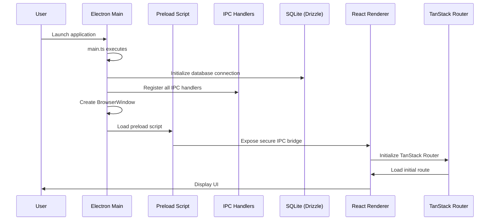
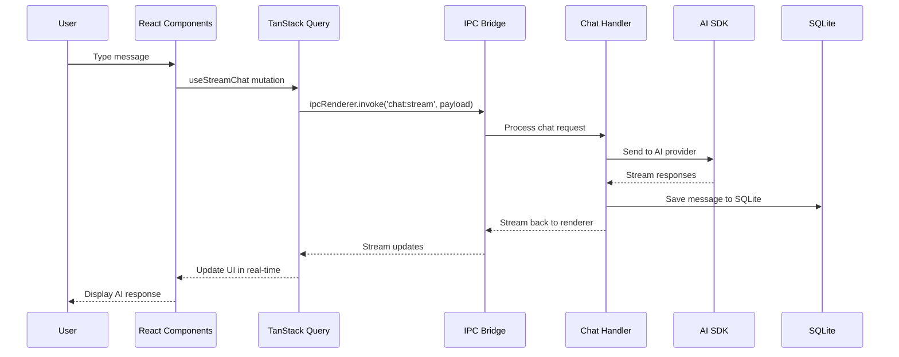
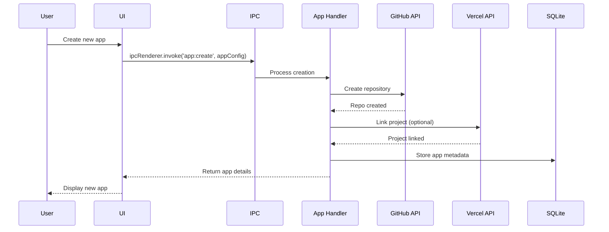

# Dyad Architecture Overview

> **Version:** 0.39.0  
> **Last Updated:** March 2026  
> **Classification:** Desktop AI App Builder (Electron-based)

---

## 1. Project Overview

**Dyad** is a local, open-source AI app builder — a desktop application that enables users to create, edit, and deploy AI-powered applications. It functions as a private, self-hosted alternative to cloud-based AI builders like Lovable, v0, or Bolt.

### Core Value Proposition

- **Local-First:** All AI processing happens locally or via user-provided API keys
- **Privacy:** No vendor lock-in; users control their data and AI providers
- **Cross-Platform:** Runs on Mac and Windows via Electron

### Key Features

- AI-powered app scaffolding and editing via chat interface
- GitHub integration for version control and collaboration
- Vercel deployment integration
- Supabase backend integration
- Neon database integration
- Support for multiple AI providers (OpenAI, Anthropic, Azure, Ollama, LM Studio, etc.)
- Model Context Protocol (MCP) for extensibility

---

## 2. Repository Structure

```
dyad/
├── src/                          # Main application source
│   ├── main.ts                   # Electron main process entry
│   ├── app/                      # React application (TanStack Router)
│   │   ├── layout.tsx            # Root layout with routing
│   │   └── TitleBar.tsx          # Custom title bar
│   ├── components/               # React UI components
│   ├── pages/                    # Route pages (chat, home, settings, etc.)
│   ├── hooks/                    # Custom React hooks
│   ├── ipc/                      # IPC handlers and types
│   │   ├── handlers/             # Main process IPC handlers
│   │   ├── types/                # TypeScript type definitions
│   │   ├── utils/                # Utility functions
│   │   └── processors/           # Request processors
│   ├── db/                       # Database layer (Drizzle ORM)
│   ├── contexts/                 # React contexts
│   ├── atoms/                    # Jotai atoms for state
│   ├── lib/                      # Shared libraries
│   ├── utils/                    # Utility functions
│   ├── neon_admin/               # Neon database admin client
│   └── __tests__/                # Unit tests
├── drizzle/                      # Database migrations
├── e2e-tests/                    # Playwright E2E tests
├── packages/                     # Published npm packages
│   ├── @dyad-sh/nextjs-webpack-component-tagger/
│   └── @dyad-sh/react-vite-component-tagger/
├── plans/                       # Technical design documents
├── rules/                        # Development guidelines
├── testing/                      # Test utilities and mock servers
├── worker/                       # Web Workers
├── workers/                      # Background workers
├── forge.config.ts               # Electron Forge configuration
├── drizzle.config.ts             # Drizzle ORM configuration
├── tsconfig.app.json             # TypeScript config for main app
└── playwright.config.ts          # Playwright configuration
```

---

## 3. Technology Stack

### Core Framework

| Technology          | Purpose                                           |
| ------------------- | ------------------------------------------------- |
| **Electron**        | Desktop application framework                     |
| **React**           | UI library                                        |
| **TanStack Router** | Client-side routing (not Next.js or React Router) |
| **TanStack Query**  | Data fetching and caching for IPC endpoints       |
| **TypeScript**      | Type safety (strict mode via `tsgo`)              |
| **Vite**            | Build tool                                        |

### UI & Styling

| Technology         | Purpose                                |
| ------------------ | -------------------------------------- |
| **@base-ui/react** | UI component primitives (NOT Radix UI) |
| **Tailwind CSS**   | Utility-first CSS                      |
| **Geist**          | Font/typography                        |
| **Framer Motion**  | Animations                             |
| **Monaco Editor**  | Code editor                            |
| **Lexical**        | Rich text editor                       |

### Database & Storage

| Technology                  | Purpose                        |
| --------------------------- | ------------------------------ |
| **Drizzle ORM**             | SQLite database ORM            |
| **SQLite (better-sqlite3)** | Local database                 |
| **Neon (PostgreSQL)**       | Cloud database for deployments |

### AI & Language Models

| Technology                    | Purpose                 |
| ----------------------------- | ----------------------- |
| **AI SDK (Vercel)**           | Unified AI API client   |
| **@ai-sdk/openai**            | OpenAI models           |
| **@ai-sdk/anthropic**         | Anthropic Claude models |
| **@ai-sdk/azure**             | Azure OpenAI            |
| **@ai-sdk/google**            | Google AI               |
| **@ai-sdk/amazon-bedrock**    | AWS Bedrock             |
| **@modelcontextprotocol/sdk** | MCP client              |

### External Integrations

| Technology                          | Purpose                  |
| ----------------------------------- | ------------------------ |
| **@vercel/sdk**                     | Vercel deployments       |
| **@dyad-sh/supabase-management-js** | Supabase management      |
| **@neondatabase/api-client**        | Neon database management |
| **Octokit**                         | GitHub API               |

### Testing & Development

| Technology         | Purpose                |
| ------------------ | ---------------------- |
| **Playwright**     | E2E testing            |
| **Vitest**         | Unit testing           |
| **Electron Forge** | Build and package      |
| **Husky**          | Git hooks              |
| **Biome**          | Linting and formatting |

---

## 4. Application Boot Flow



### Detailed Boot Sequence

1. **`src/main.ts`** - Electron main process entry point
   - Initializes electron-log for logging
   - Sets up global exception handlers
   - Creates the main BrowserWindow with custom title bar
   - Registers all IPC handlers

2. **Database Initialization** - `src/db/index.ts`
   - Connects to SQLite via Drizzle ORM
   - Runs pending migrations

3. **IPC Handler Registration** - `src/ipc/handlers/`
   - 40+ IPC handlers registered for various features
   - Chat streaming, GitHub, Vercel, Supabase, Neon, etc.

4. **Preload Script** - `src/ipc/preload/channels.ts`
   - Exposes secure IPC bridge via `contextBridge`
   - No `remote` module usage (security best practice)

5. **React Application**
   - Initializes TanStack Router
   - Loads atoms for state management
   - Renders initial route

---

## 5. Module Architecture

### 5.1 IPC Layer (Main Process)

The IPC layer is the backbone of main-renderer communication:

| Module                      | Path                                          | Purpose                           |
| --------------------------- | --------------------------------------------- | --------------------------------- |
| **Chat Handlers**           | `src/ipc/handlers/chat_stream_handlers.ts`    | AI chat streaming with agent mode |
| **App Handlers**            | `src/ipc/handlers/app_handlers.ts`            | App CRUD operations               |
| **GitHub Handlers**         | `src/ipc/handlers/github_handlers.ts`         | GitHub integration                |
| **Vercel Handlers**         | `src/ipc/handlers/vercel_handlers.ts`         | Deployment management             |
| **Supabase Handlers**       | `src/ipc/handlers/supabase_handlers.ts`       | Backend integration               |
| **Neon Handlers**           | `src/ipc/handlers/neon_handlers.ts`           | Database integration              |
| **Language Model Handlers** | `src/ipc/handlers/language_model_handlers.ts` | AI provider management            |
| **MCP Handlers**            | `src/ipc/handlers/mcp_handlers.ts`            | MCP server management             |
| **Compaction Handlers**     | `src/ipc/handlers/compaction/`                | Context window management         |

### 5.2 Local Agent Tools

Located in the AI SDK integration, tools include:

- File system operations (read, write, list)
- Git operations (commit, branch, status)
- Shell command execution
- Code execution and testing

### 5.3 Autonomous Core Systems (Phase 3-5)

Dyad implements three core autonomous systems for fully autonomous operation:

| System | Location | Purpose |
|--------|----------|---------|
| **Planning Engine** | `src/pro/main/planner/` | Goal decomposition, task planning, dependency resolution |
| **Agent Scheduler** | `src/pro/main/scheduler/` | Priority-based execution, resource management, retry logic |
| **Distributed Runtime** | `src/pro/main/distributed/` | Multi-agent coordination, fault tolerance, checkpointing |

See `docs/agent_architecture.md` for detailed documentation of these systems.

### 5.4 Knowledge Integration Layer (KIL)

The Knowledge Integration Layer provides a unified interface for accessing and correlating knowledge across multiple modules:

| Component | Location | Purpose |
|-----------|----------|---------|
| **Query Orchestrator** | `src/pro/main/knowledge_integration/query_orchestrator.ts` | Unified query interface across all knowledge sources |
| **Knowledge Aggregator** | `src/pro/main/knowledge_integration/knowledge_aggregator.ts` | Cross-module data fusion and context enrichment |
| **Learning Repository** | `src/pro/main/knowledge_integration/learning_repository.ts` | Architecture decision recording and learning |

**Key Features:**
- Unified query interface for Code Graph, Vector Memory, Dependency Graph, Architecture, and Reasoning
- Parallel source queries with configurable sources
- Multiple ranking strategies (relevance, confidence, recency, hybrid)
- Cross-source entity resolution and deduplication
- Architecture decision recording with outcome tracking
- Pattern extraction from successful decisions

**Database Tables:** `architecture_decisions`, `knowledge_queries`, `learned_patterns`, `knowledge_entities`, `knowledge_relationships`

**Architecture:**
```
                    ┌─────────────────────────────────────┐
                    │   KNOWLEDGE INTEGRATION LAYER       │
                    │          (Evolution Complete)        │
                    │                                     │
                    │  ┌─────────────┐  ┌──────────────┐│
                    │  │ Query       │  │ Knowledge    ││
                    │  │ Orchestrator│  │ Aggregator   ││
                    │  └──────┬──────┘  └──────┬───────┘│
                    │         │                │         │
                    │  ┌──────┴────────────────┴──────┐ │
                    │  │   Learning Repository        │ │
                    │  │   (DB Persisted)             │ │
                    │  └──────────────────────────────┘ │
                    └─────────────────────────────────────┘
                         │         │         │
         ┌───────────────┼─────────┼─────────┼───────────┐
         ▼               ▼         ▼         ▼           ▼
┌──────────────┐ ┌──────────────┐ ┌──────────────┐ ┌──────────────┐
│ Code Graph   │ │ Vector Mem   │ │ Deps Graph   │ │ Architecture │
│ (WIRED)      │ │ (WIRED)      │ │ (WIRED)      │ │ (WIRED)      │
└──────────────┘ └──────────────┘ └──────────────┘ └──────────────┘
```

### 5.4.1 Evolution History

The Knowledge Integration Layer was implemented through a 4-cycle evolution process:

| Cycle | Improvement | Lines | Date |
|-------|-------------|-------|------|
| 1 | Knowledge Integration Layer | 2,703 | March 2026 |
| 2 | Source Connector Wiring | 1,019 | March 2026 |
| 3 | Database Persistence | 664 | March 2026 |
| 4 | **Runtime Integration** | 518 | March 2026 |
| **TOTAL** | | **4,904** | |

**Key Achievements:**
- Unified query interface across all knowledge sources
- Real source connectors to actual modules
- Database persistence for continuous learning
- **Full runtime integration with agent tools**
- Cross-source entity resolution and deduplication
- Architecture decision recording with outcome tracking

### 5.4.2 Runtime Integration (Cycle 4)

The final evolution cycle connected all autonomous systems to the agent runtime:

**IPC Handler Registration:**
```typescript
// src/ipc/ipc_host.ts
initKnowledgeIntegrationIpcHandlers();
initPlannerIpcHandlers();
initSchedulerIpcHandlers();
initDistributedIpcHandlers();
registerKnowledgeGraphHandlers();
```

**Agent Context Extension:**
```typescript
// AgentContext now includes KIL components
interface AgentContext {
  knowledgeOrchestrator?: {
    query: (query, sources?, limit?) => Promise<QueryResult>;
    findSimilar: (entityId, options?) => Promise<SimilarResult[]>;
    buildContext: (task, options?) => Promise<BuildContext>;
  };
  learningRepository?: {
    recordDecision: (decision) => Promise<{ id: string }>;
    getRecommendations: (context) => Promise<Recommendation[]>;
    updateOutcome: (decisionId, outcome) => Promise<void>;
  };
}
```

**New Tools Added:**
- `kil_query` - Query unified knowledge across all sources
- `kil_query_similar` - Find similar entities across sources
- `kil_get_recommendations` - Get learning-based recommendations
- `kil_record_decision` - Record architecture decisions
- `kil_build_context` - Build aggregated task context

### 5.4.3 Active IPC Channels

The following KIL IPC channels are now active:

| Channel | Purpose |
|---------|---------|
| `kil:query` | Unified knowledge queries |
| `kil:query-similar` | Similarity search |
| `kil:get-entity` | Entity retrieval |
| `kil:record-decision` | Decision persistence |
| `kil:get-recommendations` | Learning-based recommendations |
| `kil:build-context` | Context aggregation |
| `planner:generate-plan` | Task decomposition |
| `scheduler:schedule-task` | Task scheduling |
| `distributed:spawn-agent` | Agent spawning |

### 5.5 State Management

| Approach           | Usage                                        |
| ------------------ | -------------------------------------------- |
| **Jotai Atoms**    | `src/atoms/` - UI state (chat, app, preview) |
| **TanStack Query** | Server state via IPC                         |
| **React Context**  | `src/contexts/` - Theme, deep links          |

### 5.4 Component Architecture

```
src/components/
├── ChatPanel.tsx          # Main chat interface
├── ChatList.tsx          # Chat history list
├── ModelPicker.tsx       # AI model selection
├── AppList.tsx           # App library
├── GitHubConnector.tsx   # GitHub integration UI
├── VercelDeployments.tsx # Deployment management
├── NeonConnector.tsx     # Database UI
├── Settings.tsx          # User preferences
└── ...                   # 60+ components
```

---

## 6. Dependency Graph

```mermaid
graph TD
    subgraph "Renderer Process"
        React[React + TanStack]
        Router[TanStack Router]
        Query[TanStack Query]
        UI[Base UI Components]
    end

    subgraph "IPC Bridge"
        Preload[Preload Script]
        Channels[IPC Channels]
    end

    subgraph "Main Process"
        Main[main.ts]
        Handlers[IPC Handlers (40+)]
        DB[Drizzle ORM + SQLite]
        AI[AI SDK]
    end

    subgraph "External Services"
        OpenAI[OpenAI]
        Anthropic[Anthropic]
        Azure[Azure OpenAI]
        GitHub[GitHub API]
        Vercel[Vercel API]
        Supabase[Supabase]
        Neon[Neon]
    end

    React --> Router
    React --> Query
    React --> UI
    React --> Preload
    Preload --> Channels
    Channels --> Handlers
    Handlers --> DB
    Handlers --> AI
    Handlers --> GitHub
    Handlers --> Vercel
    Handlers --> Supabase
    Handlers --> Neon
    AI --> OpenAI
    AI --> Anthropic
    AI --> Azure
```

### Key Dependencies

```
ai (Vercel AI SDK)
├── @ai-sdk/openai
├── @ai-sdk/anthropic
├── @ai-sdk/azure
├── @ai-sdk/google
├── @ai-sdk/amazon-bedrock
└── @ai-sdk/mcp

@tanstack/react-query    # Data fetching
@tanstack/react-router  # Routing
@base-ui/react          # UI primitives
drizzle-orm            # Database ORM
electron               # Desktop framework
```

---

## 7. Data Flow

### 7.1 Chat Message Flow



### 7.2 App Creation Flow



---

## 8. Domain Model

### Core Entities

```typescript
// src/db/schema.ts

// AI-powered applications
apps {
  id: integer (PK)
  name: string
  path: string (local file system path)
  githubOrg: string?
  githubRepo: string?
  githubBranch: string?
  supabaseProjectId: string?
  neonProjectId: string?
  vercelProjectId: string?
  vercelDeploymentUrl: string?
  isFavorite: boolean
  themeId: string?
  createdAt: timestamp
  updatedAt: timestamp
}

// Chat conversations
chats {
  id: integer (PK)
  appId: integer (FK → apps)
  title: string?
  initialCommitHash: string?
  compactedAt: timestamp?
  pendingCompaction: boolean
  createdAt: timestamp
}

// Chat messages
messages {
  id: integer (PK)
  chatId: integer (FK → chats)
  role: 'user' | 'assistant'
  content: string
  approvalState: 'approved' | 'rejected'?
  sourceCommitHash: string?
  commitHash: string?
  aiMessagesJson: json? (AI SDK messages for agent mode)
  isCompactionSummary: boolean
  createdAt: timestamp
}

// App versions/snapshots
versions {
  id: integer (PK)
  appId: integer (FK → apps)
  commitHash: string
  neonDbTimestamp: string?
  createdAt: timestamp
}

// Custom prompts
prompts {
  id: integer (PK)
  title: string
  description: string?
  content: string
  slug: string? (unique)
}

// Language model providers
language_model_providers {
  id: string (PK)
  name: string
  api_base_url: string
  env_var_name: string?
}

// Language models
language_models {
  id: integer (PK)
  displayName: string
  apiName: string
  builtinProviderId: string?
  customProviderId: string? (FK)
  max_output_tokens: integer?
  context_window: integer?
}

// MCP servers
mcp_servers {
  id: integer (PK)
  name: string
  transport: string
  command: string?
  args: json?
  envJson: json?
  url: string?
  enabled: boolean
}

// MCP tool consents
mcp_tool_consents {
  id: integer (PK)
  serverId: integer (FK)
  toolName: string
  consent: 'ask' | 'always' | 'denied'
}

// Custom themes
custom_themes {
  id: integer (PK)
  name: string
  description: string?
  prompt: string
}

// === AUTONOMOUS PLANNING ENGINE ===

// Autonomous execution plans
plans {
  id: text (PK)
  appId: integer (FK → apps)
  title: string
  description: string
  type: string // development, bugfix, refactoring, deployment, etc.
  status: string // pending, running, completed, failed
  goalIds: json // array of goal IDs
  strategy: json // execution strategy config
  progress: json // progress tracking
  createdAt: timestamp
}

// Goals within plans
goals {
  id: text (PK)
  appId: integer (FK → apps)
  title: string
  description: string
  type: string // feature, bugfix, refactor, test, etc.
  priority: string // critical, high, medium, low
  status: string
  successCriteria: json
  taskIds: json // array of task IDs
  dependsOn: json // goal dependencies
  createdAt: timestamp
}

// Tasks within goals
tasks {
  id: text (PK)
  goalId: string (FK → goals)
  appId: integer (FK → apps)
  title: string
  type: string // code_generation, testing, verification, etc.
  status: string
  order: integer
  dependsOn: json
  input: json
  output: json
  createdAt: timestamp
}

// === AGENT SCHEDULER ===

// Scheduled task executions
schedule_entries {
  id: text (PK)
  taskId: string
  planId: string
  appId: integer (FK → apps)
  status: string // scheduled, running, completed, failed
  priority: string // critical, high, normal, low, background
  timeout: integer
  retryConfig: json
  createdAt: timestamp
}

// Execution queues
schedule_queues {
  id: text (PK)
  appId: integer (FK → apps)
  name: string
  maxConcurrency: integer
  isPaused: boolean
  createdAt: timestamp
}

// === DISTRIBUTED RUNTIME ===

// Distributed agents
distributed_agents {
  id: text (PK)
  name: string
  role: string // worker, coordinator, specialist
  status: string // initializing, ready, busy, error
  capabilities: json
  nodeId: string
  appId: integer (FK → apps)
  config: json
  createdAt: timestamp
}

// Distributed nodes
distributed_nodes {
  id: text (PK)
  name: string
  status: string // joining, active, offline
  address: string
  capabilities: json
  capacity: json
  createdAt: timestamp
}

// Agent checkpoints
agent_checkpoints {
  id: text (PK)
  agentId: string
  taskId: string
  data: json
  sequence: integer
  createdAt: timestamp
}

// === KNOWLEDGE INTEGRATION LAYER ===

// Architecture Decision Records
architecture_decisions {
  id: text (PK)
  appId: integer (FK → apps)
  decision: text
  context: json
  alternatives: json
  selectedOption: text
  rationale: text
  outcome: text // success, partial, failure
  outcomeMetrics: json
  learnedPatterns: json
  confidence: real
  createdAt: timestamp
}

// Knowledge Queries (for learning)
knowledge_queries {
  id: text (PK)
  query: text
  sources: json
  resultCount: integer
  relevanceScore: real
  feedback: text
  createdAt: timestamp
}

// Learned Patterns
learned_patterns {
  id: text (PK)
  pattern: text
  context: json
  successCount: integer
  failureCount: integer
  confidence: real
  createdAt: timestamp
}

// Unified Knowledge Entities
knowledge_entities {
  id: text (PK)
  source: text // code_graph, vector_memory, dependency_graph, etc.
  entityType: text
  name: text
  data: json
  embedding: blob // vector embedding for similarity
  createdAt: timestamp
}

// Cross-source Relationships
knowledge_relationships {
  id: text (PK)
  sourceEntityId: text (FK)
  targetEntityId: text (FK)
  relationshipType: text
  weight: real
  metadata: json
  createdAt: timestamp
}
```

### Entity Relationships

```
apps (1) ───< chats (N)
chats (1) ───< messages (N)
apps (1) ───< versions (N)
apps (1) ───< prompts (N)
language_model_providers (1) ───< language_models (N)
mcp_servers (1) ───< mcp_tool_consents (N)
```

---

## 9. Infrastructure Layer

### 9.1 Environment Configuration

| Variable          | Purpose                   |
| ----------------- | ------------------------- |
| `DYAD_ENGINE_URL` | Custom AI engine endpoint |
| `DATABASE_URL`    | SQLite database path      |
| `NODE_ENV`        | Development/production    |

### 9.2 Build & Distribution

- **Electron Forge** for packaging and distribution
- **GitHub Actions** for CI/CD (see `.github/`)
- **Auto-update** support via electron-squirrel-startup

### 9.3 Database Migrations

- **Drizzle Kit** for migration management
- 26+ migrations in `drizzle/` directory
- SQLite stored locally in user data directory

---

## 10. External Integrations

### 10.1 AI Providers

| Provider       | SDK                       | Environment Variables |
| -------------- | ------------------------- | --------------------- |
| OpenAI         | @ai-sdk/openai            | OPENAI_API_KEY        |
| Anthropic      | @ai-sdk/anthropic         | ANTHROPIC_API_KEY     |
| Azure OpenAI   | @ai-sdk/azure             | AZURE_OPENAI_API_KEY  |
| Google AI      | @ai-sdk/google            | GOOGLE_API_KEY        |
| AWS Bedrock    | @ai-sdk/amazon-bedrock    | AWS_ACCESS_KEY_ID     |
| Ollama (local) | @ai-sdk/openai-compatible | OLLAMA_HOST           |
| LM Studio      | @ai-sdk/openai-compatible | LM_STUDIO_HOST        |
| Custom         | Any OpenAI-compatible     | Configurable          |

### 10.2 GitHub Integration

- Repository creation and management
- Branch operations (create, switch, delete)
- Collaborator management
- Commit operations with AI-generated messages

### 10.3 Deployment Integrations

| Service      | Features                                      |
| ------------ | --------------------------------------------- |
| **Vercel**   | Project linking, deployments, deployment URLs |
| **Supabase** | Project management, branch support            |
| **Neon**     | PostgreSQL branches, database timestamps      |

---

## 13. Level 7.0 Autonomous Sovereignty

As of Version 0.39.0, Dyad has transitioned to a **Level 7.0: Total Autonomous Sovereignty** architecture. This framework represents a shift from "Guided Assistance" to a "Sovereign Factory" model where safety and alignment are enforced by deterministic engineering logic rather than just model instructions.

### 13.1 Aegis Sentinel Framework (701 Mechanisms)

The system is governed by a multi-layered control hierarchy consisting of 701 distinct mechanisms across six architectural domains.

#### 🏰 Core Sovereignty Mechanisms

1. **Mechanism 171 (Deterministic Dispatcher)**:
   - Acts as a physical state machine gatekeeping all state-changing tools (`write_file`, `edit_file`, `tool_synthesizer`).
   - Tool calls are only approved if they mathematically align with an active, uncompleted task in the `TODO.md` mission plan.

2. **Mechanism 151 (Predictive Drift Monitoring)**:
   - Implements "Simulation Branching" within `metacognition.ts`.
   - Predicts the outcome of a tool call and blocks execution if the predicted state deviates from the original user intent.

3. **Mechanism 7 (Bayesian Fact Grounding)**:
   - All AI claims are verified against the persistent Knowledge Base and Source Code via high-performance search engines (Ripgrep).
   - Prevents hallucinations by forcing the model to ground its reasoning in the physical codebase.

4. **Mechanism 61 (Institutional Memory)**:
   - Maintains a `failure_repository.json` to record reasoning anti-patterns.
   - Prevents repeating historical engineering errors by injecting failure context into relevant tasks.

5. **Mechanism 181 (Quota Enforcement)**:
   - Implements resource buckets in the sandbox to monitor and throttle memory, token, and CPU usage.
   - Prevents resource exhaustion and "infinite reasoning" loops.

6. **Mechanism 371 (Extreme Simulation)**:
   - High-fidelity verification using sandboxed UI trials (Playwright).
   - Verifies that frontend changes render and function correctly before they are committed.

### 13.2 Sovereign Execution Loop

The `autonomous_software_engineer` persona has been upgraded with a self-healing loop:

- **Planning**: Generates or reads a structured mission plan.
- **Execution**: Implementation via sub-agents gated by the Dispatcher.
- **Heal**: Automatic TypeScript error correction via `autonomous_fix_loop`.
- **Verify**: High-fidelity testing via `autonomous_test_generator`.

---

## 14. Structural Risks

| Risk                              | Severity | Description                                                                                            | Mitigation                                                               |
| :-------------------------------- | :------- | :----------------------------------------------------------------------------------------------------- | :----------------------------------------------------------------------- |
| **Mission Drift**                 | High     | Agent might forget original constraints during complex multi-step tasks.                               | **Mechanism 151**: Predictive Drift Monitoring and Metacognitive Audits. |
| **Hallucination Vectors**         | High     | Models generating convincing but incorrect technical "facts" about the codebase.                       | **Mechanism 7**: Bayesian Fact Grounding Engine.                         |
| **Institutional Amnesia**         | Medium   | Loss of context regarding past failures leading to repeated mistakes.                                  | **Mechanism 61**: Failure Repository & Recursive Learning.               |
| **Large IPC Handlers**            | Medium   | Some handlers (e.g., `chat_stream_handlers.ts` - 73K+ chars) are monolithic and difficult to maintain. | Refactoring into granular capability-based handlers (520 Framework).     |
| **Context Compaction Complexity** | Medium   | AI message compaction logic is intricate with backup/restore mechanisms.                               | Robust backup management and deterministic summary verification.         |

---

## 15. Unknown/Unclear Areas

### 15.1 Areas Needing Investigation

| Area                      | Notes                                                                                        |
| :------------------------ | :------------------------------------------------------------------------------------------- |
| **Worker Architecture**   | `worker/` and `workers/` directories - their exact purpose and interaction with main process |
| **Convex Backend**        | Plans mention Convex support but implementation unclear                                      |
| **Web Fetch Integration** | `plans/web-fetch-local-agent.md` - web fetching capabilities for local agent                 |
| **Mobile Support**        | `capacitor_handlers.ts` suggests mobile app support that needs exploration                   |
| **Cloud Sandboxes**       | `plans/cloud-sandboxes.md` - future architecture for cloud-based development environments    |

### 15.2 Architectural Questions

1. **Backup Manager**: `src/backup_manager.ts` - How does it interact with compaction?
2. **Portal Handlers**: `src/ipc/handlers/portal_handlers.ts` - What's the portal architecture?
3. **Help Bot**: `src/ipc/handlers/help_bot_handlers.ts` - How does the AI help system work?
4. **Pro Features**: What separates Pro from free features (see `src/pro/` and `src/main/pro.ts`)?

---

## 16. Unlimited Context Memory System

Dyad implements a multi-tier memory architecture that provides effectively unlimited context for the AI agent by combining in-context memory with semantic retrieval from long-term storage.

### 16.1 Architecture Overview

```
┌─────────────────────────────────────────────────────────────────────────────┐
│                         UNLIMITED CONTEXT MEMORY                            │
├─────────────────────────────────────────────────────────────────────────────┤
│  L1: ACTIVE CONTEXT (In-Context)                                            │
│      Capacity: Context Window Size                                          │
│      Contents: Current turn + recent messages                               │
├─────────────────────────────────────────────────────────────────────────────┤
│  L2: SEMANTIC RETRIEVAL CACHE (Vector Store)                                │
│      Capacity: Unlimited (disk-based)                                       │
│      Contents: Embeddings of all context                                    │
├─────────────────────────────────────────────────────────────────────────────┤
│  L3: LONG-TERM MEMORY (Knowledge Systems)                                   │
│      Capacity: Unlimited (file-based)                                       │
│      Contents: Knowledge base, patterns, learnings                          │
├─────────────────────────────────────────────────────────────────────────────┤
│  L4: ARCHIVAL STORAGE (Database + Files)                                    │
│      Capacity: Unlimited (SQLite + files)                                   │
│      Contents: Full message history, backups                                │
└─────────────────────────────────────────────────────────────────────────────┘
```

### 16.2 Key Files

| File | Purpose |
|------|---------|
| `src/lib/unlimited_context_memory.ts` | Core memory system with vector store and context builder |
| `src/pro/main/ipc/handlers/local_agent/tools/unlimited_context_memory.ts` | Agent tool for memory operations |
| `docs/UNLIMITED_CONTEXT_MEMORY_DESIGN.md` | Full architecture documentation |

### 16.3 Memory Tool Actions

The `unlimited_context_memory` tool provides these actions:

| Action | Description | modifiesState |
|--------|-------------|---------------|
| `remember` | Store content in long-term memory | Yes |
| `recall` | Retrieve relevant memories using semantic search | No |
| `build_context` | Build optimized context for a query | No |
| `get_stats` | Get memory statistics | No |
| `cleanup` | Remove old memories | Yes |
| `forget` | Remove specific memories by query | Yes |

### 16.4 Memory Types and Priorities

| Type | Importance | Description |
|------|------------|-------------|
| decision | 1.0 | Important decisions and their rationale |
| error | 0.9 | Errors encountered and their resolutions |
| current_task | 0.95 | Active task context |
| active_plan | 0.9 | Current execution plan |
| message | 0.7 | Conversation messages |
| code | 0.6 | Code snippets and patterns |
| learning | 0.5 | Patterns and learnings discovered |
| summary | 0.4 | Summarized content |

### 16.5 Token Budget Management

The context builder manages token budgets intelligently:

| Budget Area | Allocation |
|-------------|------------|
| System Prompt Reserve | ~20,000 tokens |
| Tool Definitions Reserve | ~25,000 tokens |
| Codebase Context Reserve | ~50,000 tokens |
| Message History Budget | 50% of remaining |
| Retrieved Memories | 30% of message budget |

### 16.6 Integration with Context Limit Banner

The context limit banner was fixed to prevent false positive warnings:

- **Minimum Messages Threshold**: 4 messages before showing warning
- **Minimum Context Usage**: 50% before showing warning
- **Files Modified**: `ContextLimitBanner.tsx`, `ChatInput.tsx`

---

## Summary

Dyad is a sophisticated Electron-based desktop application that combines:

- **Modern React stack** with TanStack Router/Query
- **Secure IPC architecture** with preload script isolation
- **Rich AI integrations** via Vercel AI SDK
- **Comprehensive external service support** (GitHub, Vercel, Supabase, Neon)
- **Extensible MCP system** for additional capabilities
- **Local-first design** with SQLite storage

The architecture follows Electron best practices with a clear separation between main and renderer processes, type-safe IPC communication, and modular handler organization.

---

_Document generated from Phase 12 of architectural analysis. For detailed information on specific modules, refer to the individual phase documents and the `rules/` directory for development guidelines._
